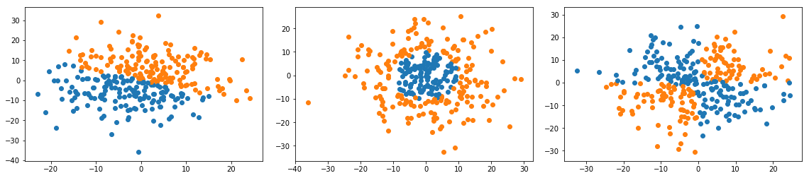
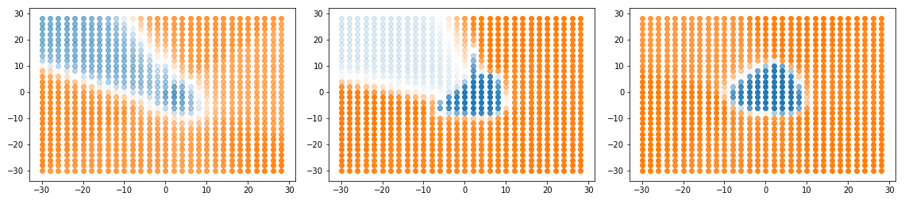

Simple neural network playground I made to learn forward and backward propagation

The network consists of 2 hidden layers, each fallowed by an activation function, and outputs softmax probabilities for 2 classes.
The training data type, training parameters and number of perceptron per layer can be changed.

The training progress of the network can be seen if the ```plot_output_during_training``` flag is set. Check out the [jupyter notebook](./nn-implementation.ipynb) for more info.

Training data types: Linear, Circular, Check board



Sample NN output during training (tanh activation, circular training data):


